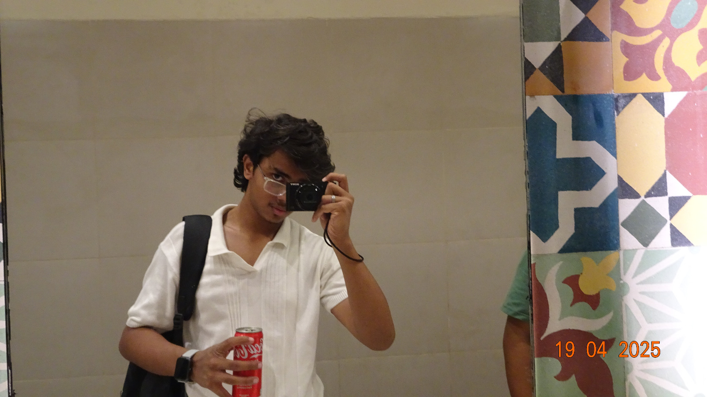

## File: .DS_Store

*Binary file (no text lines)*
First 32 bytes (hex): 00 00 00 01 42 75 64 31 00 00 10 00 00 00 08 00 00 00 10 00 00 00 00 86 00 00 00 00 00 00 00 00

---

## File: IDEA.md

   1: portfolio website upgrade

---

## File: whatshere.md

   1: ### File: pfp.jpg
   2: - Size: 340879 bytes (332.89 KB)
   3: - Last modified: 2026-06-27 13:46:02
   4: - File type: JPEG image data, JFIF standard 1.01, aspect ratio, density 1x1, segment length 16, baseline, precision 8, 1600x899, components 3
   5: - Preview:
   6: ```
   7: (binary file, no text preview)
   8: ```
   9: 
  10: ### File: index.html
  11: - Size: 12906 bytes (12.60 KB)
  12: - Last modified: 2026-06-27 13:46:02
  13: - File type: HTML document text, Unicode text, UTF-8 text
  14: - Preview:
  15: ```
  16: <!DOCTYPE html>
  17: <html lang="en">
  18: <head>
  19:     <meta charset="UTF-8">
  20:     <meta name="viewport" content="width=device-width, initial-scale=1.0">
  21: ```
  22: 
  23: ### File: style.css
  24: - Size: 1265 bytes (1.24 KB)
  25: - Last modified: 2026-06-27 13:46:02
  26: - File type: ASCII text, with CRLF line terminators
  27: - Preview:
  28: ```
  29: @import url('https://fonts.googleapis.com/css2?family=Inter:wght@300;400;500;600;700&display=swap');
  30: body {
  31:     font-family: 'Inter', -apple-system, BlinkMacSystemFont, 'Segoe UI', Roboto, Oxygen, Ubuntu, Cantarell, sans-serif;
  32: }
  33: 
  34: ```
  35: 
  36: ### File: components/navbar.js
  37: - Size: 2532 bytes (2.47 KB)
  38: - Last modified: 2026-06-27 13:46:02
  39: - File type: HTML document text, ASCII text, with CRLF line terminators
  40: - Preview:
  41: ```
  42: class CustomNavbar extends HTMLElement {
  43:     connectedCallback() {
  44:         this.attachShadow({ mode: 'open' });
  45:         this.shadowRoot.innerHTML = `
  46:             <style>
  47: ```

---

## File: Hritish.online-main/pfp.jpg

*Binary file (no text lines)*
First 32 bytes (hex): ff d8 ff e0 00 10 4a 46 49 46 00 01 01 00 00 01 00 01 00 00 ff db 00 43 00 03 02 02 02 02 02 03

---

## File: Hritish.online-main/index.html

   1: <!DOCTYPE html>
   2: <html lang="en">
   3: <head>
   4:     <meta charset="UTF-8">
   5:     <meta name="viewport" content="width=device-width, initial-scale=1.0">
   6:     <title>Hritish Narayanan | Software Developer</title>
   7: <link rel="stylesheet" href="style.css">
   8:     <script src="https://cdn.tailwindcss.com"></script>
   9:     <script src="https://cdn.jsdelivr.net/npm/feather-icons/dist/feather.min.js"></script>
  10:     <script src="https://unpkg.com/feather-icons"></script>
  11:     <script>
  12:         tailwind.config = {
  13:             theme: {
  14:                 extend: {
  15:                     colors: {
  16:                         primary: '#5b21b6',
  17:                         secondary: '#10b981',
  18:                         dark: '#0f172a',
  19:                         light: '#f8fafc'
  20:                     }
  21:                 }
  22:             }
  23:         }
  24:     </script>
  25:     <!-- Vercel Speed Insights -->
  26:     <script type="module">
  27:         import { injectSpeedInsights } from 'https://cdn.jsdelivr.net/npm/@vercel/speed-insights@2.0.0/+esm';
  28:         injectSpeedInsights();
  29:     </script>
  30: </head>
  31: <body class="bg-gradient-to-br from-gray-50 to-gray-100 min-h-screen font-sans text-gray-900">
  32: 
  33: <main class="container mx-auto px-4 py-8 max-w-6xl">
  34:         <!-- Hero Section -->
  35:         <section class="grid md:grid-cols-2 gap-12 items-center py-12">
  36:             <div>
  37:                 <h1 class="text-4xl md:text-5xl font-bold leading-tight">
  38:                     Hi, I'm <span class="text-primary">Hritish</span>
  39:                 </h1>
  40:                 <div class="mt-2 font-mono text-gray-600">
  41:                     Software & security — apps, games, blockchain
  42:                 </div>
  43:                 <p class="mt-6 text-gray-700 max-w-lg">
  44:                     Just a chill guy who likes to build any kind of software and make sure it is optimized and can be run on all devices.
  45:                 </p>
  46:                 <div class="mt-8 flex flex-wrap items-center gap-4">
  47:                     <a href="#projects" class="bg-primary hover:bg-primary/90 text-white px-6 py-3 rounded-lg font-medium transition-all shadow-lg hover:shadow-primary/30">
  48:                         View Projects
  49:                     </a>
  50:                     <div class="text-sm text-gray-500">
  51:                         Open to internships · Open-source friendly
  52:                     </div>
  53:                 </div>
  54:                 <div class="mt-6 flex flex-wrap gap-4">
  55:                     <div class="flex items-center gap-2 bg-white px-4 py-2 rounded-full shadow-sm">
  56:                         <i data-feather="shield" class="w-4 h-4 text-primary"></i>
  57:                         <span class="text-sm">Web Security</span>
  58:                     </div>
  59:                     <div class="flex items-center gap-2 bg-white px-4 py-2 rounded-full shadow-sm">
  60:                         <i data-feather="code" class="w-4 h-4 text-primary"></i>
  61:                         <span class="text-sm">App Development</span>
  62:                     </div>
  63: 
  64:                     <div class="flex items-center gap-2 bg-white px-4 py-2 rounded-full shadow-sm">
  65:                         <i data-feather="code" class="w-4 h-4 text-primary"></i>
  66:                         <span class="text-sm">Game Development</span>
  67:                     </div>
  68:                     <div class="flex items-center gap-2 bg-white px-4 py-2 rounded-full shadow-sm">
  69:                         <i data-feather="lock" class="w-4 h-4 text-primary"></i>
  70:                         <span class="text-sm">Blockchain</span>
  71:                     </div>
  72:                 </div>
  73:             </div>
  74:             <div class="relative">
  75:                 <div class="absolute inset-0 bg-gradient-to-br from-primary to-secondary rounded-2xl -rotate-6"></div>
  76:                 <div class="relative bg-white p-1 rounded-2xl shadow-xl overflow-hidden h-80 rotate-1">
  77:                     
  78: <div class="absolute bottom-0 left-0 right-0 bg-gradient-to-t from-black/70 to-transparent p-6">
  79:                         <h3 class="font-bold text-xl text-white">Hritish Narayanan</h3>
  80:                         <p class="text-gray-200 mt-1">Security & Blockchain Dev</p>
  81:                     </div>
  82:                 </div>
  83: </div>
  84:         </section>
  85: 
  86:         <!-- Projects Section -->
  87:         <section id="projects" class="py-16">
  88:             <div class="text-center mb-12">
  89:                 <h2 class="text-3xl font-bold">My Projects</h2>
  90:                 <p class="text-gray-600 mt-2 max-w-2xl mx-auto">A few security-focused projects and writeups</p>
  91:             </div>
  92:             <div class="grid md:grid-cols-2 gap-6">
  93:                 <div class="bg-white rounded-xl shadow-lg overflow-hidden border border-gray-100 hover:shadow-xl transition-all">
  94:                     <div class="h-48 bg-gradient-to-r from-primary to-secondary flex items-center justify-center">
  95:                         <i data-feather="lock" class="w-12 h-12 text-white"></i>
  96:                     </div>
  97:                     <div class="p-6">
  98:                         <h3 class="text-xl font-bold">Automatic Exam Filler</h3>
  99:                         <p class="text-gray-600 mt-2">Automates filling Google API & Forms for exams.</p>
 100:                         <div class="mt-4 flex flex-wrap gap-2">
 101:                             <span class="text-xs px-3 py-1 bg-primary/10 text-primary rounded-full">Python</span>
 102:                             <span class="text-xs px-3 py-1 bg-primary/10 text-primary rounded-full">Automation</span>
 103:                             <span class="text-xs px-3 py-1 bg-primary/10 text-primary rounded-full">AI</span>
 104:                         </div>
 105:                         <a href="https://github.com/Hritish-Narayanan/Automatic-exam-google-docs-and-forms-filler" class="mt-6 inline-flex items-center text-primary font-medium hover:underline">
 106:                             View Project <i data-feather="arrow-right" class="w-4 h-4 ml-1"></i>
 107:                         </a>
 108:                     </div>
 109:                 </div>
 110:                 <div class="bg-white rounded-xl shadow-lg overflow-hidden border border-gray-100 hover:shadow-xl transition-all">
 111:                     <div class="h-48 bg-gradient-to-r from-secondary to-primary flex items-center justify-center">
 112:                         <i data-feather="shield" class="w-12 h-12 text-white"></i>
 113:                     </div>
 114:                     <div class="p-6">
 115:                         <h3 class="text-xl font-bold">Onion Wallet</h3>
 116:                         <p class="text-gray-600 mt-2">A privacy-focused crypto wallet concept built with secure principles.</p>
 117:                         <div class="mt-4 flex flex-wrap gap-2">
 118:                             <span class="text-xs px-3 py-1 bg-primary/10 text-primary rounded-full">Blockchain</span>
 119:                             <span class="text-xs px-3 py-1 bg-primary/10 text-primary rounded-full">Privacy</span>
 120:                             <span class="text-xs px-3 py-1 bg-primary/10 text-primary rounded-full">Encryption</span>
 121:                         </div>
 122:                         <a href="https://github.com/Hritish-Narayanan/Onion-Wallet" class="mt-6 inline-flex items-center text-primary font-medium hover:underline">
 123:                             View Project <i data-feather="arrow-right" class="w-4 h-4 ml-1"></i>
 124:                         </a>
 125:                     </div>
 126:                 </div>
 127:             </div>
 128:         </section>
 129: 
 130:         <!-- About Section -->
 131:         <section id="about" class="py-16">
 132:             <div class="flex flex-col md:flex-row gap-8">
 133:                 <div class="md:w-2/3">
 134:                     <h2 class="text-3xl font-bold mb-6">About Me</h2>
 135:                     <p class="text-gray-700 mb-8">
 136:                         My interests are Cybersecurity, App/Game development and Blockchain. I like to take things apart to see how they work, fix them, and build simple tools that are actually useful. No frills, just real projects and real learning.
 137:                     </p>
 138:                     <div class="grid md:grid-cols-2 gap-6">
 139:                         <div class="bg-white p-6 rounded-xl shadow-sm border border-gray-100">
 140:                             <h3 class="font-bold text-lg mb-3">Programming Languages</h3>
 141:                             <ul class="space-y-2 text-gray-600">
 142:                                 <li class="flex items-center gap-2">
 143:                                     <i data-feather="check" class="w-4 h-4 text-primary"></i>
 144:                                     <span>Python, JavaScript, Java</span>
 145:                                 </li>
 146:                                 <li class="flex items-center gap-2">
 147:                                     <i data-feather="check" class="w-4 h-4 text-primary"></i>
 148:                                     <span>C++, C#, SQL, Go</span>
 149:                                 </li>
 150:                                 <li class="flex items-center gap-2">
 151:                                     <i data-feather="check" class="w-4 h-4 text-primary"></i>
 152:                                     <span>Kotlin, HTML, CSS</span>
 153:                                 </li>
 154:                             </ul>
 155:                         </div>
 156:                         <div class="bg-white p-6 rounded-xl shadow-sm border border-gray-100">
 157:                             <h3 class="font-bold text-lg mb-3">Cybersecurity Tools</h3>
 158:                             <ul class="space-y-2 text-gray-600">
 159:                                 <li class="flex items-center gap-2">
 160:                                     <i data-feather="shield" class="w-4 h-4 text-primary"></i>
 161:                                     <span>Kali, Burp Suite, Wireshark</span>
 162:                                 </li>
 163:                                 <li class="flex items-center gap-2">
 164:                                     <i data-feather="shield" class="w-4 h-4 text-primary"></i>
 165:                                     <span>Hashcat, John the Ripper</span>
 166:                                 </li>
 167:                                 <li class="flex items-center gap-2">
 168:                                     <i data-feather="shield" class="w-4 h-4 text-primary"></i>
 169:                                     <span>SQLmap, Hydra, Metasploit</span>
 170:                                 </li>
 171:                             </ul>
 172:                         </div>
 173:                     </div>
 174:                 </div>
 175:                 <div class="md:w-1/3">
 176:                     <div class="bg-white p-6 rounded-xl shadow-sm border border-gray-100 sticky top-6">
 177:                         <h3 class="font-bold text-lg mb-4">Contact Me</h3>
 178:                         <p class="text-gray-600 mb-6">Available for internships & collaborations.</p>
 179:                         <ul class="space-y-4">
 180:                             <li class="flex items-center gap-3">
 181:                                 <div class="w-10 h-10 rounded-full bg-primary/10 flex items-center justify-center">
 182:                                     <i data-feather="phone" class="w-4 h-4 text-primary"></i>
 183:                                 </div>
 184:                                 <a href="tel:+919444961083" class="hover:underline">+91-9444961083</a>
 185: </li>
 186:                             <li class="flex items-center gap-3">
 187:                                 <div class="w-10 h-10 rounded-full bg-primary/10 flex items-center justify-center">
 188:                                     <i data-feather="instagram" class="w-4 h-4 text-primary"></i>
 189:                                 </div>
 190:                                 <a href="https://instagram.com/hritishnarayanan" class="hover:underline" target="_blank">@hritishnarayanan</a>
 191: </li>
 192:                             <li class="flex items-center gap-3">
 193:                                 <div class="w-10 h-10 rounded-full bg-primary/10 flex items-center justify-center">
 194:                                     <i data-feather="mail" class="w-4 h-4 text-primary"></i>
 195:                                 </div>
 196:                                 <a href="mailto:hritishnarayanan@gmail.com" class="font-medium hover:underline">hritishnarayanan@gmail.com</a>
 197: </li>
 198:                             <li class="flex items-center gap-3">
 199:                                 <div class="w-10 h-10 rounded-full bg-primary/10 flex items-center justify-center">
 200:                                     <i data-feather="github" class="w-4 h-4 text-primary"></i>
 201:                                 </div>
 202:                                 <a href="https://github.com/Hritish-Narayanan" class="hover:underline">github.com/Hritish-Narayanan</a>
 203:                             </li>
 204:                         </ul>
 205:                     </div>
 206:                 </div>
 207:             </div>
 208:         </section>
 209:     </main>
 210: 
 211:     <custom-footer></custom-footer>
 212:     <script src="components/footer.js"></script>
 213: <script>
 214:         feather.replace();
 215:     </script>
 216: </script>
 217: </body>
 218: </html>

---

## File: Hritish.online-main/.DS_Store

*Binary file (no text lines)*
First 32 bytes (hex): 00 00 00 01 42 75 64 31 00 00 10 00 00 00 08 00 00 00 10 00 00 00 00 25 00 00 00 00 00 00 00 00

---

## File: Hritish.online-main/style.css

   1: @import url('https://fonts.googleapis.com/css2?family=Inter:wght@300;400;500;600;700&display=swap');
   2: body {
   3:     font-family: 'Inter', -apple-system, BlinkMacSystemFont, 'Segoe UI', Roboto, Oxygen, Ubuntu, Cantarell, sans-serif;
   4: }
   5: 
   6: /* Link styles */
   7: a {
   8:     color: #5b21b6;
   9:     text-decoration: none;
  10:     transition: all 0.2s ease;
  11: }
  12: 
  13: a:hover {
  14:     text-decoration: underline;
  15:     color: #4c1d95;
  16: }
  17: /* Custom scrollbar */
  18: ::-webkit-scrollbar {
  19:     width: 8px;
  20:     height: 8px;
  21: }
  22: 
  23: ::-webkit-scrollbar-track {
  24:     background: #f1f1f1;
  25: }
  26: 
  27: ::-webkit-scrollbar-thumb {
  28:     background: #5b21b6;
  29:     border-radius: 4px;
  30: }
  31: 
  32: ::-webkit-scrollbar-thumb:hover {
  33:     background: #4c1d95;
  34: }
  35: 
  36: /* Animation classes */
  37: .animate-float {
  38:     animation: float 6s ease-in-out infinite;
  39: }
  40: 
  41: @keyframes float {
  42:     0% { transform: translateY(0px); }
  43:     50% { transform: translateY(-15px); }
  44:     100% { transform: translateY(0px); }
  45: }
  46: .animate-pulse-slow {
  47:     animation: pulse 4s cubic-bezier(0.4, 0, 0.6, 1) infinite;
  48: }
  49: 
  50: /* Special link styles that shouldn't be underlined */
  51: .nav-link,
  52: .resume-btn,
  53: .social-icon {
  54:     text-decoration: none !important;
  55: }
  56: @keyframes pulse {
  57:     0%, 100% { opacity: 1; }
  58:     50% { opacity: 0.8; }
  59: }

---

## File: Hritish.online-main/components/navbar.js

   1: class CustomNavbar extends HTMLElement {
   2:     connectedCallback() {
   3:         this.attachShadow({ mode: 'open' });
   4:         this.shadowRoot.innerHTML = `
   5:             <style>
   6:                 nav {
   7:                     font-family: 'Inter', -apple-system, BlinkMacSystemFont, 'Segoe UI', Roboto, Oxygen, Ubuntu, Cantarell, sans-serif;
   8:                     box-shadow: 0 4px 30px rgba(0, 0, 0, 0.2);
   9:                 }
  10: .nav-link {
  11:                     transition: all 0.3s ease;
  12:                     position: relative;
  13:                 }
  14:                 .nav-link:hover {
  15:                     color: white;
  16:                     text-shadow: 0 0 8px rgba(255, 255, 255, 0.5);
  17:                 }
  18:                 .nav-link::after {
  19:                     content: '';
  20:                     position: absolute;
  21:                     width: 0;
  22:                     height: 3px;
  23:                     bottom: -5px;
  24:                     left: 0;
  25:                     background-color: #fbbf24;
  26:                     border-radius: 2px;
  27: transition: width 0.3s ease;
  28:                 }
  29:                 .nav-link:hover::after {
  30:                     width: 100%;
  31:                 }
  32:                 .resume-btn {
  33:                     transition: all 0.3s ease;
  34:                 }
  35:                 .resume-btn:hover {
  36:                     transform: translateY(-3px) scale(1.02);
  37:                     box-shadow: 0 10px 15px rgba(251, 191, 36, 0.3);
  38: }
  39:             </style>
  40:             <nav class="bg-white/80 backdrop-blur-md shadow-sm fixed w-full z-50">
  41:                 <div class="container mx-auto px-6 py-4">
  42:                     <div class="flex items-center justify-between">
  43:                         <div class="hidden md:flex items-center space-x-8">
  44:                             <a href="#projects" class="nav-link text-gray-700">Projects</a>
  45:                             <a href="#about" class="nav-link text-gray-700">About</a>
  46:                             <a href="#resume" class="resume-btn px-4 py-2 text-sm font-medium text-primary border border-primary rounded-lg hover:bg-primary hover:text-white">
  47:                                 Resume
  48:                             </a>
  49:                         </div>
  50: <button class="md:hidden focus:outline-none">
  51:                             <i data-feather="menu" class="w-6 h-6 text-gray-700"></i>
  52:                         </button>
  53:                     </div>
  54:                 </div>
  55:             </nav>
  56:         `;
  57:     }
  58: }
  59: 
  60: customElements.define('custom-navbar', CustomNavbar);

---
